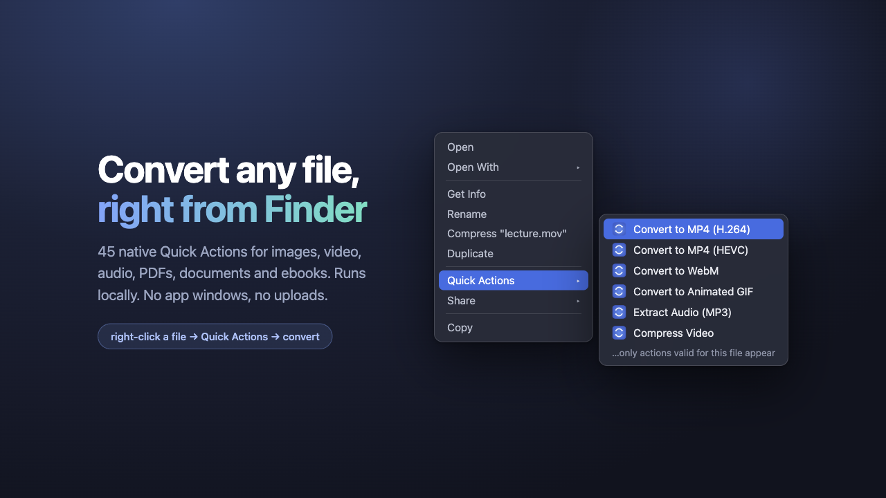

<h1 align="center">MacConvert</h1>

<p align="center">
  <em>Convert files from Finder's right-click menu. 45 native Quick Actions.</em>
</p>

<p align="center">
  <a href="https://github.com/pehqge/macconvert/actions/workflows/ci.yml"></a>
  <a href="https://github.com/pehqge/macconvert/releases"></a>
  
  <a href="LICENSE"></a>
  <a href="https://github.com/sponsors/pehqge"></a>
</p>

<p align="center">
  
</p>

Right-click a file, pick a conversion under **Quick Actions**, and the
converted copy lands next to the original. That's the whole workflow. Behind
it sit the tools you'd reach for anyway (ffmpeg, ImageMagick, Pandoc,
Ghostscript), wired into Finder so you never have to open a terminal or, worse,
upload your files to some converter website.

## Install

```sh
brew install pehqge/tap/macconvert
macconvert setup
```

Or from a clone, if you'd rather see what you're running:

```sh
git clone https://github.com/pehqge/macconvert.git
cd macconvert && ./install.sh
```

Setup opens an interactive picker where you choose which Quick Actions you
want, and it only installs the dependencies for what you picked. If you skip
everything video-related, ffmpeg never touches your disk.

<p align="center">
  
</p>

## What you get

| File type | Converts to |
|---|---|
| **Image** | PNG · JPG · WebP · HEIC · TIFF · GIF · AVIF · ICO · ICNS · PDF (multi-select combines into one) |
| **Video** | MP4 (H.264) · MP4 (HEVC, hardware-accelerated) · MOV · WebM · MKV · animated GIF · extract MP3/M4A/WAV · compress |
| **Audio** | MP3 · WAV · FLAC · M4A · OGG · OPUS |
| **PDF** | PNG/JPG per page · text · DOCX · compress |
| **Document** | DOCX ⇄ PDF/Markdown/HTML · Markdown ⇄ PDF/DOCX/HTML · HTML ⇄ Markdown/PDF · XLSX → PDF · PPTX → PDF |
| **Ebook** | EPUB → MOBI/PDF · MOBI → EPUB · **Send to Kindle** |

The menu only shows conversions that make sense for the file you clicked.
Multi-select works: grab fifty photos, run one action, done. And nothing is
ever overwritten; if `photo.png` already exists you get `photo (1).png`.

## Manage it anytime

```sh
macconvert            # interactive menu
macconvert menu       # enable/disable any subset of actions
macconvert doctor     # health check
macconvert update     # update to the latest release
macconvert uninstall  # remove everything cleanly
```

Prefer not to think about updates? `macconvert autoupdate on` sets up a
weekly background check.

## Send to Kindle

An opt-in action that emails PDFs, EPUBs and documents straight to your
Kindle. `macconvert kindle setup` walks you through the three pieces:

1. your `@kindle.com` address,
2. the email account that does the sending (Gmail, iCloud or Outlook app
   password; the password goes in the macOS Keychain, not in a file, and
   existing Calibre settings import in one step),
3. authorizing that sender on Amazon: [amazon.com/sendtokindle/email](https://www.amazon.com/sendtokindle/email)
   → **Approved Personal Document E-mail List** → add the sender address.

Then `macconvert kindle test` sends a test document to confirm the chain
works. Delivery goes through the system's `curl`, so there's nothing extra to
install.

## How it works

Each action is a real macOS Service: a `.workflow` bundle generated
programmatically into `~/Library/Services`, scoped to Finder by file type
(UTI). The bundles call zsh scripts installed under
`~/Library/Application Support/MacConvert`, which means you can delete the
cloned repo after installing and everything keeps working.

Failures notify you and point at `~/Library/Logs/macconvert/<action>.log`
with the exact tool error. Successes stay silent, because the new file
showing up next to the original is feedback enough. Nothing runs with
elevated privileges.

Every conversion is covered by an end-to-end test
([`tests/verify.sh`](tests/verify.sh)) that drives the installed bundles
through the same `automator` path Finder uses.

## Troubleshooting

- **Actions missing from the menu:** run `macconvert doctor`, then restart
  Finder with `killall Finder`. Still missing? Check System Settings →
  Privacy & Security → Extensions → Finder.
- **A conversion fails:** the notification points at the action's log, which
  has the exact stderr from the underlying tool.

## Contributing

A new conversion takes one script and one manifest row. See
[CONTRIBUTING.md](CONTRIBUTING.md).

## License

[MIT](LICENSE)
